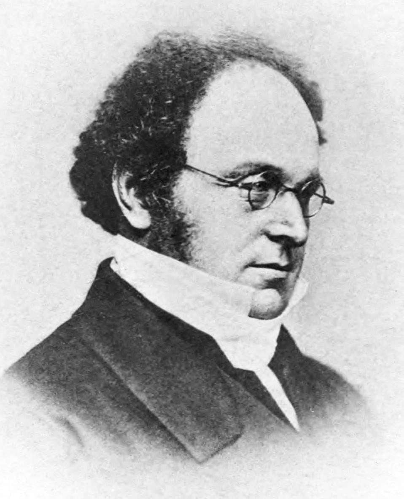

# Logique Booléenne

## Propositions et Valeur de Vérité

### Propositions

::: {.definition #def:proposition name="Proposition"}

En logique, une **proposition** est une déclaration qui est soit **vraie** (True) soit **fausse** (False).

:::

::: example

- "Le soleil se lève à l'est." est une proposition vraie.
- "2 + 2 = 5." est une proposition fausse.
:::

Les propositions sont les éléments de base de la logique booléenne, où elles sont notées par des lettres comme $P$, $Q$, $R$, etc.

### Valeur de Vérité

::: {.definition #def:verite name="Valeur de vérité"}

La **valeur de vérité** d'une proposition est la valeur (True ou False) associée à cette proposition.

- Si une proposition est vraie, on note sa valeur de vérité $V$ ou $1$.
- Si une proposition est fausse, on note sa valeur de vérité $F$ ou $0$.

:::

## Algèbre de Boole

^[ George Boole (1815 - 1864) fondateur de la logique moderne.]

L'**algèbre de Boole** est un système mathématique qui traite des opérations sur des valeurs de vérité (True/False ou 1/0). Elle est essentielle en informatique pour concevoir des circuits logiques et des programmes.

### Opérateurs Booléens

::: {.definition #def:not name="Complément"}

- **NON (NOT)** : L'opération $\neg P$ inverse la valeur de vérité de $P$.
  
  | $P$ | $\neg P$ |
  |---|---|
  | 0 | 1 |
  | 1 | 0 |

:::

::: {.definition #def:or name="OU logique"}

- **OU (OR)** : L'opération $P \lor Q$ est vraie si au moins l'une des propositions $P$ ou $Q$ est vraie. C'est une *addition* logique.
  
  | $P$ | $Q$ | $P \lor Q$ |
  |---|---|---|
  | 0 | 0 | 0 |
  | 0 | 1 | 1 |
  | 1 | 0 | 1 |
  | 1 | 1 | 1 |

:::

::: {.definition #def:and name="ET logique"}

- **ET (AND)** : L'opération $P \land Q$ est vraie si et seulement si $P$ et $Q$ sont toutes deux vraies. C'est un *produit* logique.
  
  | $P$ | $Q$ | $P \land Q$ |
  |---|---|---|
  | 0 | 0 | 0 |
  | 0 | 1 | 0 |
  | 1 | 0 | 0 |
  | 1 | 1 | 1 |

:::

::: {.definition #def:nor name="NON-OU logique"}

- **NON-OU (NOR)** : L'opération $P \lnor Q$ est vraie si aucune des propositions $P$ ou $Q$ est vraie.
  
  | $P$ | $Q$ | $P \lnor Q$ |
  |---|---|---|
  | 0 | 0 | 1 |
  | 0 | 1 | 0 |
  | 1 | 0 | 0 |
  | 1 | 1 | 0 |

:::

::: {.definition #def:and name="NON-ET logique"}

- **NON-ET (NAND)** : L'opération $P \lnand Q$ est fausse si $P$ et $Q$ sont toutes deux vraies. Sinon l'opération est vraie.
  
  | $P$ | $Q$ | $P \lnand Q$ |
  |---|---|---|
  | 0 | 0 | 1 |
  | 0 | 1 | 1 |
  | 1 | 0 | 1 |
  | 1 | 1 | 0 |

:::

::: {.definition #def:xor name="OU exclusif"}

- **X-OU (XOR)** : L'opération $P \lxor Q$ est vraie si une des propositions $P$ ou $Q$ est vraie mais pas les deux.
  
  | $P$ | $Q$ | $P \lxor Q$ |
  |---|---|---|
  | 0 | 0 | 0 |
  | 0 | 1 | 1 |
  | 1 | 0 | 1 |
  | 1 | 1 | 0 |

:::

### Théorèmes de Base

::: {.theorem #theo:identite name="Identité"}

  - $P \land 1 = P$
  - $P \lor 0 = P$
 
:::

::: {.theorem #theo:domination name="Domination"}

  - $P \lor 1 = 1$
  - $P \land 0 = 0$

:::

::: {.theorem #theo:negation name="Double Négation"}

  - $\neg(\neg P) = P$

:::

::: {.theorem #theo:idempotence name="Idempotence"}

  - $P \land P = P$
  - $P \lor P = P$

:::

::: {.theorem #theo:complementarite name="Complémentarité"}

  - $P \land \neg P = 0$
  - $P \lor \neg P = 1$

:::

::: {.theorem #theo:distributivite name="Distributivité"}

  - $P \land (Q \lor R) = (P \land Q) \lor (P \land R)$
  - $P \lor (Q \land R) = (P \lor Q) \land (P \lor R)$

:::

### Théorèmes de De Morgan

Les **lois de De Morgan**^[ Auguste De Morgan (1806 - 1871) il a fondé avec Boole la logique moderne] sont des règles fondamentales en algèbre de Boole, très utiles pour simplifier les expressions logiques.

::: {.theorem #theo:de-morgan name="De Morgan"}

- **Première loi de De Morgan :**
  $\neg(P \land Q) = \neg P \lor \neg Q$
  
  Cela signifie que la négation d'un "ET" est équivalente à l'"OU" des négations.

- **Deuxième loi de De Morgan :**
  $\neg(P \lor Q) = \neg P \land \neg Q$
  
  Cela signifie que la négation d'un "OU" est équivalente à l'"ET" des négations.

:::

::: example
Simplifier l'expression $\neg(A \land B)$:

En appliquant la première loi de De Morgan :

$\neg(A \land B) = \neg A \lor \neg B$
:::

## Simplification des Formules

### Tableau de Karnaugh

Le **tableau de Karnaugh** (ou carte de Karnaugh) ^[ Maurice Karnaugh (1924 - 2022) Ingénieur en télécomunication au laboratoire Bell.] est un outil graphique utilisé pour simplifier les expressions logiques. Il permet de visualiser les combinaisons de valeurs de vérité et de minimiser les termes en regroupant les 1 de manière optimale.

Pour une fonction de deux variables $A$ et $B$, le tableau de Karnaugh est un carré 2x2, chaque cellule représentant une combinaison de $A$ et $B$.

| A/B | 0  | 1  |
|-----|----|----|
|  0  |  - |  - |
|  1  |  - |  - |

- Les lignes et colonnes sont étiquetées avec les valeurs possibles des variables.
- Les cases sont remplies avec les valeurs de la fonction pour chaque combinaison.

Pour simplifier une fonction booléenne :

1. **Identifier les 1 dans le tableau** : Repérez les cases contenant des 1.
2. **Regrouper les 1 adjacents** : Formez des groupes (rectangles) de 1 adjacents de tailles 1, 2 et 4.
3. **Écrire la nouvelle expression** : Pour chaque groupe, identifiez les variables qui restent constantes (même valeur dans tout le groupe) et écrivez le produit (ET) de ces variables.

::: example

Simplifions la fonction suivante $f(A, B)$ donnée par sa table de vérité :

| A/B | 0 | 1 |
|-----|---|---|
|  0  | 1 | 1 |
|  1  | 0 | 1 |

En regroupant les 1, vous pourriez obtenir une expression simplifiée :

$f(A, B) = B \lor \neg A$

:::

### Autre méthode

#### Avec 2 variables

Une autre méthode similaire consiste à faire un carré avec un axe pour chaque variable. On place un point à chaque sommet correspondant à un 1. Ensuite ou regroupe les points par carré, arrete ou sommet.

<!-- TODO -->

::: example

Pour L'exemple précédent, on peut obtenir le carré suivant:

{width=50%}

:::

#### Avec 3 variables

Pour ajouter une variable on ajoute une dimension. Passez le carré en cube en ajoutant l'axe pour la troisième variable. La méthode reste inchangée.

::: example

{width=50%}

:::

#### Avec plus de variables ?

On ajoute une dimmension par variable. C'est plus simple que ça en à l'air car l'espace est booléen. Ajoutez un axe qui part de votre cube et arrive à un autre cube, cet axe sera votre variable suplémentaire. Pour une variable de plus on utilise un axe de plus pour 4 cubes. Puis un cube constitué de 8 cube et ainsi de suite. Bien sûr, cette méthode devient exponentiellement plus difficile avec les variable mais reste une solution réalisable.

::: example

{width=100%}

:::